# SAP Cloud Application Programming Model: Пошаговое создание приложения

## Содержание

<details>
  <summary>Кликните сюда, чтобы развернуть</summary>

  - [Цели](#objectives)
  - [Подготовка среды](#prep)
    * [Аккаунт на SAP Business Technology Platform](#prep-btp)
    * [Подготовка SAP Business Application Studio](#prep-bas)
    * [Подготовка локальной среды с Visual Studio Code](#prep-local)
    * [Подготовка базы данных SAP HANA](#prep-hana)
  - [Что такое CDS](#cds)
  - [Создание проекта](#project)
    * [Через шаблон](#project-template)
    * [Через CDS](#project-cds)
    * [Структура созданного проекта](#project-structure)
    * [Запуск проекта](#project-start)
  - [Создание моделей (с локализацией)](#models)
    * [Загрузка данных моделей](#models-upload)
  - [Создание сервисов](#services)
    * [Для пользователей](#services-users)
    * [Для администраторов](#services-admins)
  - [Настройка постоянной базы данных](#databases)
    * [SQLite](#databases-sqlite)
    * [SAP HANA](#databases-hana)
  - [Аутентификация и Авторизация](#auth)
    * [Аннотации для разграничения доступа к модели](#auth-annotations)
    * [Тестирование на mock-пользователях](#auth-mock)
    * [Интеграция с SAP Cloud Platform](#auth-scp)
  - [Создание фронтенда](#ui)
  - [Локализация](#local)
    * [Статические данные](#local-static)
    * [Динамические данные](#local-dynamic)
</details>

## Цели
<a name="objectives"></a>

Мы хотим разобраться в новой технологии от компании SAP — фреймворке для создания enterprise-приложений Cloud Application Programming (CAP) Model. Для этого мы пошагово создадим minimal working example (MWE) — веб-приложение на Node.js с использованием лучших практик, которые предоставляет нам этот фреймворк.

Мы ограничимся созданием очень простого приложения для заказа и покупки оборудования и запасных частей с UI SAP Fiori, но мы включим в него такие функции, как развёртывание базы данных SAP HANA, локализацию, аутентификацию и авторизацию. Также упомянем, что вместо Fiori можно использовать любой frontend-фреймворк.

Параллельно перед нами есть задача разобраться с азами работы с SAP Business Application Studio — специальным сервисом для SAP Business Technology Platform (BTP), предоставляющий современную онлайн-IDE, полностью заточенную под разработку приложений для SAP Intelligent Enterprise. В основе SAP BAS лежит open-source IDE фреймворк Eclipse Theia, который очень близок по workflow и интерфейсу к Visual Studio Code, поэтому пользователям последней разработка в BAS должна показаться комфортной. Процесс подготовки этой IDE к началу разработки мы опишем [ниже](#prep-bas), но мы также [распишем инструкции](#prep-local) для подготовки и локальной среды для тех читателей, которым привычнее работать на локальной машине.

## Подготовка среды
<a name="prep"></a>
<!-- 1 -->

### Аккаунт на SAP Business Technology Platform
<a name="prep-btp"></a>
<!-- 1-01 -->

Подразумевается, что мы уже зарегистрированы на [SAP.com](https://www.sap.com/). После того, как мы вошли в свой аккаунт, переходим на [страницу trial-версии SAP BTP](https://account.hanatrial.ondemand.com/). Система потребует подтвердить аккаунт номером телефона и принять условия.

После успешного входа на платформу BTP нам нужно создать в ней subaccount. На выбор предлагается три региона — Восток США, Сингапур и Европа. Мы выберем Европу из-за её географической близости.

Подготовка аккаунта (развёртывание его в указанном облаке, и т.д.) займёт не более пары минут. Если на каком-то из этапов возникнет ошибка, система предложит выбрать облако в другом регионе. По завершению процесса мы можем войти в подготовленный аккаунт, нажав "Enter Your Free Account".

В итоге мы должны увидеть подобную страницу:

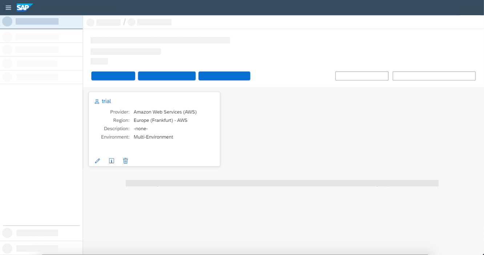

### Подготовка SAP Business Application Studio
<a name="prep-bas"></a>
<!-- 1-02 -->

В пробном режиме нам доступен один subaccount (сабаккаунт) "trial" с единственной средой "dev". Для просмотра доступных сервисов и плагинов мы можем перейти в Services > Service Marketplace в боковой панели.

Для этого примера мы будем работать во встроенной IDE от компании SAP — Business Application Studio. Эта IDE позволяет в несколько кликов настроить среду разработки, а также предоставляет ряд свойств "из коробки" (такие, как авто-дополнение). Сперва нам нужно связать наш аккаунт с BAS:

1. В боковом меню переходим в Security > Trust Configuration
2. Выбираем Default identity provider (дефолтный менеджер ролей в сабаккаунте)
3. Вбиваем e-mail, под которым мы зарегистрированы на портале SAP (если мы не уверены, то мы можем его посмотреть, кликнув на наше имя в правом верхнем углу страницы и нажав "User Information") и жмём "Show Assignments"
4. В таблице Role collections мы видим, что у нас уже есть роль администратора (Subaccount Administrator). Жмём "Assign Role Connections", выбираем из списка "Business_Application_Studio_Administrator" и добавляем эту роль.

Далее переходим в Service Marketplace, ищем в нём "SAP Business Application Studio" (на который мы уже подписаны в trial-аккаунте), нажимаем на скрытое меню (три точки в правом верхнем углу плитки) и жмём "Go to Application".

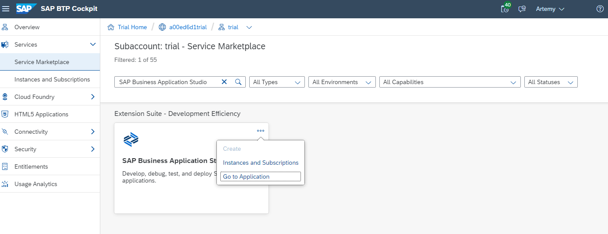

Нам нужно создать Dev Space — нечто по типу заранее настроенной изолированной виртуальной машины, в которую добавили требуемые утилиты (в зависимости от указанного нами типа приложения). Жмём "Create Dev Space", вводим имя (например, "DeviceOrdering") и выбираем тип приложения "Full Stack Cloud Application". В основном окне справа в левом столбце показаны дополнения SAP, которые будут установлены и настроены в создаваемом Dev Space. Мы также можем выбрать доступные дополнения из правого столбца, но нам достаточно выбранных приложений. Отметим, что все перечисленные дополнения (такие как CDS Tools) можно установить и вручную (например, в локальной среде разработки). SAP Business Application Studio просто может всё настроить за нас. Жмём "Create Dev Space" и ожидаем завершения подготовки новой среды.

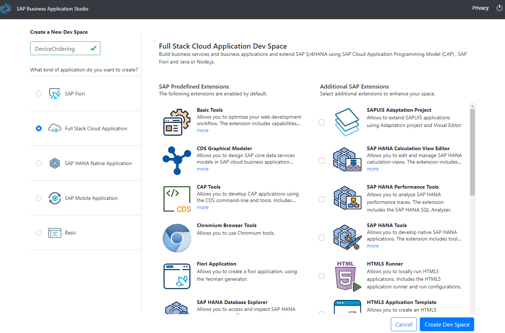

Когда статус среды сменится на "RUNNING", то кликом по имени ("DeviceOrdering") мы попадаем в нашу Web IDE (SAP Business Application Studio).

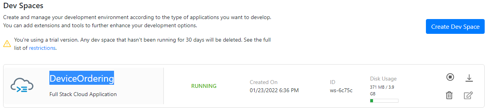

В SAP Business Application Studio нам практически не придётся ничего вручную настраивать, так как в ней уже есть заготовленные шаблоны со всеми необходимыми опциями. Также в неё включены ряд дополнительных инструментов для упрощения процесса разработки (таких как, например, собственный REST-клиент для тестирования HTTP-запросов и SQLTools для удобного взаимодействия с файлами баз данных). Помимо этого, в облачной IDE уже установлены и настроены CLI-утилиты для взаимодействия с CloudFoundry и MTA (Multi-Target Application), работа с которыми нам понадобится в контексте этой инструкции. В среде доступна и система управления версиями Git, поэтому при желании возможно загрузить уже готовый open-source проект.

В этой инструкции мы будем вести разработку полностью в SAP Business Application Studio с параллельной демонстрацией возможностей этой облачной IDE. Поэтому мы порекомендуем и читателям использовать её в процессе создания данного MWE.

### Подготовка локальной среды с Visual Studio Code
<a name="prep-local"></a>
<!-- 1-04 -->

В качестве возможной альтернативы SAP Business Application Studio можно настроить среду разработки и на локальной машине. Как уже формулировалось в [целях этой инструкции](#objectives), наше приложение мы будем писать на платформе Node.js, поэтому на локальной машине должны быть установлены

* [Node.js](https://nodejs.org/en/download/) (v14.17.6+)
* [NPM](https://www.npmjs.com/) (v6.14.15+).

Когда мы убедились, что необходимый софт поставлен, установим SAP NPM регистр (Registry):

```sh
$ npm set @sap:registry=https://npm.sap.com
```

Далее устанавливаем Core Data Services (CDS) CLI утилиту, которая будет служить фундаментом всей разработки:

```sh
$ npm install -g @sap/cds
```

Рекомендуется также глобально установить утилиту CDS Development Kit:

```sh
$ npm install -g @sap/cds-dk
```

Чтобы убедиться, что установка прошла успешно, вызываем

```sh
$ cds --version
```

На момент составления этой инструкции вывод в системе Windows таков:

```bat
@sap/cds: 5.8.0
@sap/cds-compiler: 2.12.0
@sap/cds-dk: 4.8.0
@sap/cds-foss: 3.1.0
@sap/eslint-plugin-cds: 2.3.2
Node.js: v16.14.0
home: C:\Users\username\AppData\Roaming\npm\node_modules\@sap\cds
```

Далее потребуется установить CLI-утилиту CloudFoundry `cf` и средство сборки MTA архивов. Загрузить и установить CloudFoundry CLI можно [здесь](https://docs.cloudfoundry.org/cf-cli/install-go-cli.html), а установка утилиты `mbt` (MTA Build Tool) для сборки MTA возможна с помощью пакетного менеджера для Node.js `npm`:

```sh
$ npm install -g mbt
```

Напоследок займёмся подготовкой выбранной нами IDE. В этом разделе покажем это на примере редактора Visual Studio Code в силу его популярности среди разработчиков. Во вкладке Extensions редактора ищем "CDS" и устанавливаем дополнение "SAP CDS Language Support".

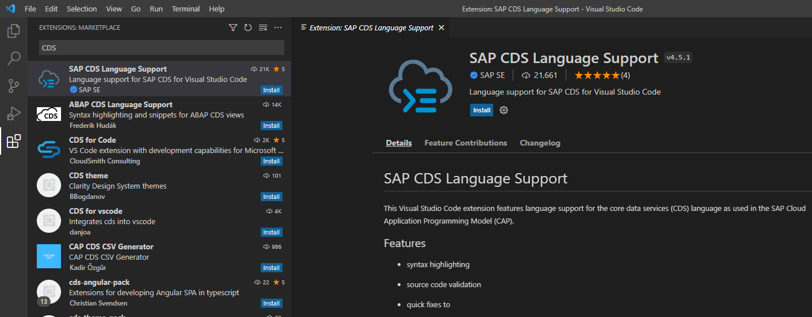

Дополнительно рекомендуется установить REST-клиент [Postman](https://www.postman.com/) для проверок HTTP-запросов к серверу приложения.

### Подготовка базы данных SAP HANA
<a name="prep-hana"></a>
<!-- 1-03 -->

В процессе разработки этого учебного приложения мы, в частности, рассмотрим настройку подключения его к СУБД разных типов. Одной из таких СУБД будет SAP HANA, но её требуется заранее подготовить в trial-сабаккаунте на SAP BTP.

По аналогии с предыдущим разделом идём в Service Marketplace, ищем "SAP HANA Schemas & HDI Containers", щёлкаем на три точки в углу и жмём "Create".

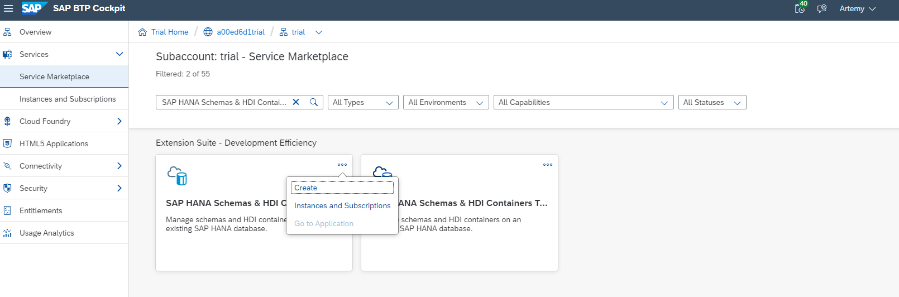

В поле "Plan" выбираем "hdi-shared", в качестве наименования сервиса "Instance Name" используем "dms-database". Жмём "Create", после чего сервис должен успешно запуститься.

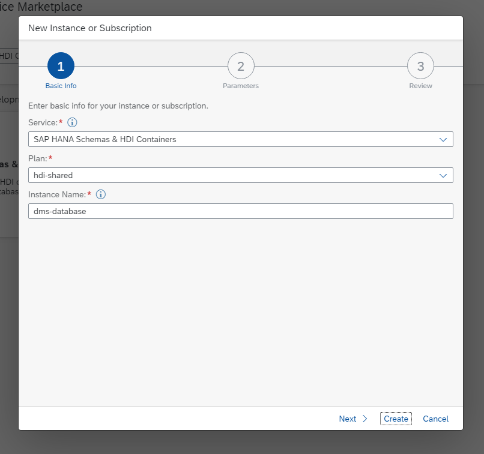

Далее необходимо развернуть саму базу данных SAP HANA в нашей среде "dev". Заходим в "dev" (через Subaccount Overview), выбираем в боковой панели "SAP HANA Cloud" и жмём "Create" > "SAP HANA database". 

В открывшемся настройщике выбираем тип "SAP HANA Cloud, SAP HANA Database", далее вводим имя "dms-hana", устанавливаем DBA пароль и можем щёлкать "Next Step".

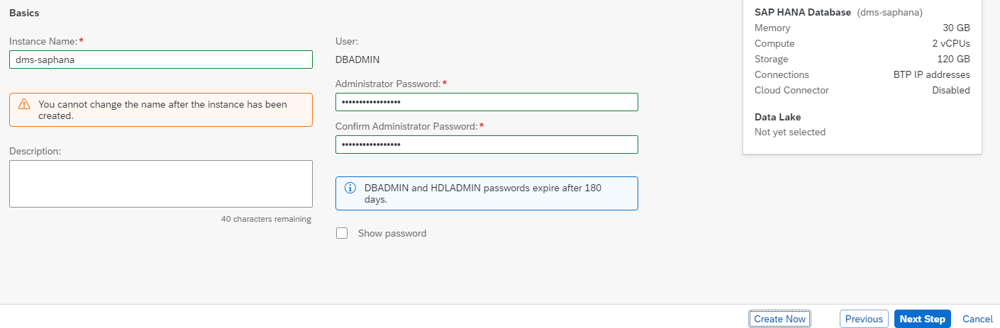

В процессе настройки SAP HANA Cloud необходимо убедиться, что политика безопасности разрешает доступ к базе данных без ограничения по типу используемых IP адресов.


Процесс развёртывания базы может занять несколько минут, но по итогу должен сгенериться экземпляр базы данных SAP HANA c зелёной меткой "Created":

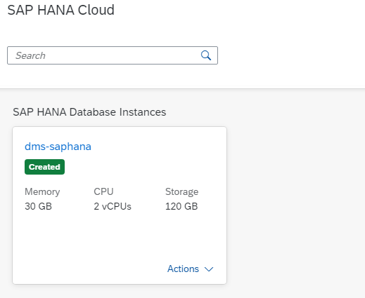

## Что такое CDS
<a name="cds"></a>
<!-- 2 -->

CDS (Core Data Services) — ключевой кирпич в фундаменте CAP, который состоит из нескольких компонентов, позволяющих нам сфокусироваться исключительно на бизнес-логике нашей модели. CDS автоматом трансформирует определения, выражения и запросы модели в формат JSON (JavaScript Object Notation). Таким образом CDS умеет парсить форматы (например, JSON или YAML) и конвертировать их в другие форматы (например, в OData или HANA DDL).

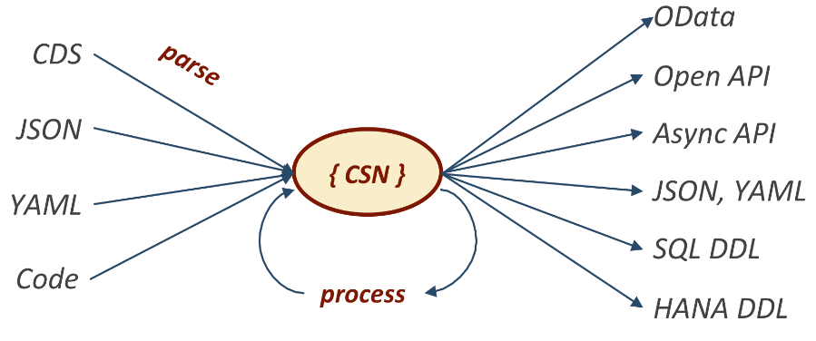

CDS создаёт JSON при помощи CSN (Core Schema Notation) — усовершенствованной версии спецификации схемы JSON. Модели обрабатываются (и могут также генериться) динамически во время прогона.

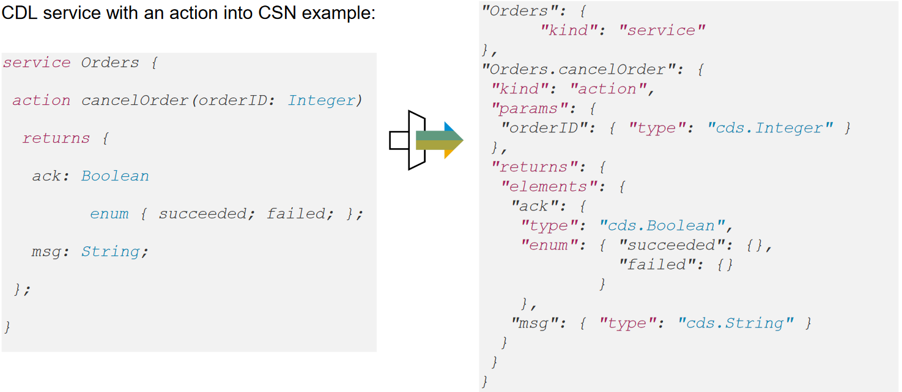

Перечислим основные компоненты CDS:

- CDL (Core Data Language) — синтаксис для определения модели (entities, views, associations, aspects, types, service definitions, и т.д.);
- CSN (Core Schema Notation) — формат представления данных, который поддерживает связи между entities и relationships;
- CQL/CDS QL — язык запросов к БД, поддерживающий дополнительные возможности (такие, как выражения пути к данным и определения через CDL).

## Создание проекта
<a name="project"></a>
<!-- 3 -->

В SAP Business Application Studio проект можно создать двумя способами: либо через готовый шаблон, либо через CLI-утилиту CDS.

### Через шаблон
<a name="project-template"></a>
<!-- 3-01 -->

1. На Welcome-странице SAP Business Application Studio щёлкаем по плитке "Start from template"
2. Из набора шаблонов выбираем "CAP Project" и жмём "Start"
3. Именуем наш проект (например, "dms" (device management system)), ставим рантаймом Node.js (т.к. будем писать наше приложение именно на нём) и жмём "Finish".

Спустя несколько секунд должен сгенериться и открыться в Проводнике IDE проект dms с заданной структурой. Стоит отметить, что все проекты следует создавать в папке

```sh
/home/user/projects/
```

### Через CDS
<a name="project-cds"></a>
<!-- 3-02 -->

1. Открываем терминал: либо через верхнее меню Terminal > New Terminal, либо через сокращение `` Ctrl+` ``
2. Убеждаемся, что мы находимся в папке `/home/user/projects/`
3. Запускаем в терминале команду `cds init dms`, где `dms` — имя нашего проекта.

Через несколько секунд создастся такой же проект с точно такой же структурой, как и в предыдущем параграфе. Не забываем перейти в терминале в только что созданный проект:

```sh
$ cd dms
```

###  Структура созданного проекта
<a name="project-structure"></a>
<!-- 3-03 -->

Созданный проект имеет следующую структуру:

Папка/Файл     | Предназначение
---------------|------------------------
`app/`         | Папка для фронтенд разработки
`db/`          | Папка для определения наших дата-моделей
`srv/`         | Папка для задания сервисов
`.cdsrc.json`  | Файл настройки CDS (можно настроить и в `package.json`)
`.eslintrc`    | Файл настройки линтера для Node.js
`package.json` | Файл с базовой информацией о нашем приложении
`README.md`    | Короткий начальный гайд

### Запуск проекта
<a name="project-start"></a>
<!-- 3-04 -->

Для запуска проекта достаточно

* установить необходимые модули командой `npm install`
* запустить `cds watch` — в основе команды лежит утилита `nodemon`, поэтому (в совокупности с авто-сохранением в IDE) любые изменения будут подхватываться автоматически.

## Создание моделей (с локализацией)
<a name="models"></a>
<!-- 4 -->

Начнём разработку нашего веб-приложения для заказа устройств с определения моделей, с которыми мы будем работать. Мы хотим, чтобы в приложении все устройства были разбиты по категориям: например, чтобы Lenovo Thinkpad был в категории "Компьютеры", а iPhone — в "Смартфонах". Мы также хотим, чтобы поддерживалась локализация записей: скажем, наше приложение поддерживает два языка — русский и английский, следовательно, в зависимости от выбранного языка мы хотим корректно отображать категории и описания устройств.

Создадим в папке `db/` файл [`schema.cds`](./dms/db/schema.cds). Сперва нам нужно задать в нём _пространство имён_ для нашего проекта, а также добавить несколько часто используемых _аспектов_ и _типов_.

```
// Set the project's namespace
namespace sap.capire.dms;
// Import common aspects and types
using { cuid, managed, Currency } from '@sap/cds/common';
```

Про выше добавленные (и другие) аспекты можно [почитать в документации](https://cap.cloud.sap/docs/cds/common#common-reuse-aspects).

Итак, можно начать определять наши модели — начнём с определений устройства и категории. Мы попутно будем стараться снабжать наш код комментариями. Добавляем следующие определения в файл [`db/schema.cds`](./dms/db/schema.cds#L6):

```
/*
 * Entity definition for a device
 * Automatically add the `createdAt`, `createdBy`, `modifiedAt` and `modifiedBy` fields
 */
entity Devices : managed {
    key ID: Integer;
    name: String(32);
    category: Association to Categories;
    description: localized String(128);
    quantity: Integer;
    price: Decimal(5,2);
    currency: Currency;
}

/*
 * Entity definition for a category of devices
 * Auto-generate and add UUIDs as the primary key (via the `cuid` aspect)
 */
entity Categories : cuid {
    name: localized String(16);
    devices: Association to many Devices on devices.category = $self;
}
```

В определение категорий (`Categories`) мы добавили аспект `cuid`, который при компиляции средствами CDS для каждого экземпляра будет автоматически генерировать и добавлять первичный ключ `ID` типа `UUID`. При добавлении данных мы сможем также прописывать атрибут `ID` вручную, что мы и сделаем для упрощения воспроизводимости данного примера: ниже мы вручную добавим данные о товарах и пропишем идентификаторы категорий. Атрибут `name` — название категории, которое зависит от выбранного языка (с помощью _модификатора_ `localized`), атрибут `devices` — _ассоциация_ к множеству экземпляров `Devices` по полю `category` (иными словами, множество устройств, входящих в исходную категорию).

В определении же устройств (`Devices`) мы вручную задали следующие атрибуты:
- `ID` — идентификатор устройства в виде целого числа (`Integer`, а не `UUID`)
- `name` — название устройства, которое зависит от языка
- `category` — категория устройства, связанная с определением `Categories`
- `description` — описание устройства, зависящее от языка
- `quantity` — количество экземпляров данного устройства на складе
- `price` — цена одного экземпляра, состоящая из пяти знаков до запятой и двух — после
- `currency` — валюта для значения цены, состоящая из трёхбуквенной аббревиатуры (например, "USD" или "RUB"). Причём если мы взглянем на тип `Currency` [в документации](https://cap.cloud.sap/docs/cds/common#entity-sapcommoncurrencies), то увидим, что он определён двумя атрибутами: `code` и `symbol`.

Обратим внимание, что к этому определению добавлен аспект `managed`. Это означает, что в определение автоматом будут добавлены и самостоятельно обновляться ещё четыре атрибута — `createdAt`, `createdBy`, `modifiedAt` и `modifiedBy`. Также для некоторых атрибутов типа `String` мы добавили `localized`, чтобы впоследствии наша модель автоматом прогрузила переводы (см. [раздел по локализации динамических данных](#local-dynamic)).

Заметим, что после инициализации файла `schema.cds` в терминале появилась следующая запись:

```sh
[cds] - connect to db > sqlite { database: ':memory:' }
/> successfully deployed to sqlite in-memory db
```

При создании схемы в папке `db/`, она автоматически будет развёрнута в памяти на базе данных SQLite. Методы деплоя [на постоянные БД будут представлены ниже](#databases). В самом начале работы с проектом рекомендуется работать с базой данных in-memory.

### Загрузка данных моделей
<a name="models-upload"></a>
<!-- 4-01 -->

Следует загрузить сами данные для созданной дата-модели, чтобы мы могли взаимодействовать с конкретными устройствами и категориями. Файлы с данными должны лежать в папке `db/data` (необходимо эту папку создать) и иметь имя в формате `<ПРОСТРАНСТВО ИМЁН ПРИЛОЖЕНИЯ>-<ИМЯ ОПРЕДЕЛЕНИЯ ШАБЛОНА>` (без треугольных скобок). Так, если у нас есть CSV файл с устройствами, то в нашем случае мы его назовём `sap.capire.dms-Devices.csv`, а файл с категориями — `sap.capire.dms-Categories.csv`. По этим файлам во время развёртывания приложения автоматически будут заполнены таблицы соответствующих объектов. В нашем примере будем использовать следующие данные

[`db/data/sap.capire.dms-Categories.csv`](./dms/db/data/sap.capire.dms-Categories.csv):
```
ID;name
1;Laptops
2;Tablets
3;Smartphones
```

[`db/data/sap.capire.dms-Devices.csv`](./dms/db/data/sap.capire.dms-Devices.csv):
```
ID;name;category_ID;description;quantity;price;currency_code
101;Lenovo Thinkpad T480;1;Business laptop;15;740;usd
102;Acer Swift 7;1;Lightweight and thinner than typical laptops;20;860;usd
103;Dell XPS 15;1;Amazing speakers, beautiful display and comfy keyboard;8;949.95;usd
201;Samsung Galaxy Tab A8;2;A screen everyone will love: it brings out the best in every moment on a 10.5" LCD screen;32;234;usd
202;Apple iPad;2;No decription;14;189.95;usd
203;Microsoft Surface Pro 7;2;Whatever your office looks like, be it a cubicle or cafe, new Surface Pro 7 is your ultra-light, endlessly adaptable partner;0;900;usd
284;Toshiba Encore 2;2;Tablet for business use cases;42;120;usd
301;Apple iPhone 12;3;Backed by a one-year satisfaction guarantee;0;779;usd
```

Заметим, что в заголовке CSV с данными об устройствах мы можем явно указывать атрибут из другого определения через нижнее подчёркивание. Так, для каждого устройства мы явно прописали ID категории, к которому оно относится, а для типа `Currency` мы указали код валюты. Также у нас в файлах уже прописаны все идентификаторы, и они успешно сохранились в нашей модели в тех форматах, которые указаны в схеме. Наконец, обратим внимание, что устройств с идентификаторами "203" и "301" сейчас нет на складе (атрибут `quantity` равно нулю).

## Создание сервисов
<a name="services"></a>
<!-- 5 -->

После загрузки данных в нашу модель watcher `cds watch` нам сообщает, что не найдено ни одного сервиса:

```
No service definitions found in loaded models.
Waiting for some to arrive...
```

Поэтому самое время их создать. Мы напишем два отдельных сервиса: один для обычных пользователей, которые могут искать и заказывать устройства в нашем приложении, второй — для администраторов, обслуживающих приложение.

### Для пользователей
<a name="services-users"></a>
<!-- 5-01 -->

Сперва нам необходимо определить модель заказов, которые пользователь сможет совершать. Логичный шаг — определить отдельно шаблон для отдельного устройства (элемента) в заказе `OrderItem`, и шаблон самого заказа как совокупность устройств `Orders`. При этом нам, очевидно, следует связать экземпляр заказываемого устройства из `Devices` с экземпляром `OrderItem`, а каждый `OrderItem` добавить в совокупность `Orders`.

Добавим следующие два определения в [`db/schema.cds`](./dms/db/schema.cds#L29):

```
/*
 * Entity definition for a single ordered device
 * Connect to the Orders entity via the `parent` field
 * Connect to the device ordered via the `device` field
 */
entity OrderItems : cuid {
    parent: Association to Orders;
    device: Association to Devices;
    quantity: Integer;
}

/*
 * Entity definition for the set of orders
 */
entity Orders : cuid, managed {
    OrderNr: String @title: 'Order Number';
    Items: Composition of many OrderItems on Items.parent = $self;
}
```

В нашем приложении будет реализован функционал заказа сразу нескольких экземпляров одних и тех же устройств, поэтому в определении `OrderItems` присутствует атрибут `quantity`.

Когда объекты для осуществления заказов определены в модели, можно приступать к разработке самого сервиса, который будет отвечать за пользовательский каталог. Создаём в папке `srv` новый файл [`user.cds`](./dms/srv/user.cds). В первую очередь мы включаем созданную нами схему:

```
// Import the project schema containing all the models
using { sap.capire.dms as dms } from '../db/schema';
```

Далее, определяем сервис, указывая его endpoint (`/browse`):

```
// Define catalog service on route "/browse"
service CatalogService @(path:'/browse') {
    // Require user authorization
    @requires_: 'authenticated-user'
    // Allow users to only view devices with no access to its administrative fields
    @readonly entity Devices as select from dms.Devices {*,
      category.name as category  // Output category by name
    } excluding {createdAt, createdBy, modifiedAt, modifiedBy};
    // Allow only to create orders
    @insertonly entity Orders as projection on dms.Orders;
}
```

В нём мы указываем, к каким шаблонам (и к каким их полям) предоставляется доступ, с какими объектами можно взаимодействовать и кто может просматривать данный сервис. В частности, сервис `CatalogService`, расположенный на эндпоинте `/browse`, доступен только прошедшим аутентификацию пользователям, позволяет просматривать объекты `Devices` без атрибутов для администраторов и создавать объекты `Orders`.

Действительно, в терминале появилась запись, что определён новый сервис `CatalogService` на эндпоинте `/browse`:

```sh
[cds] - serving CatalogService { at: '/browse' }

[cds] - server listening on { url: 'http://localhost:4004' }
```

Посмотрим, как наше приложение сейчас выглядит. Мы можем либо щёлкнуть кнопку "Open in New Tab" во всплывшем в правом нижнем углу окне:

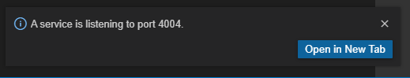

либо щёлкнуть с зажатой клавишей Ctrl по ссылке в терминале:

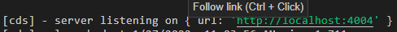

Откроется сервер, где можно следить за состоянием дата-моделей и сгенерированными метаданными для каждого эндпойнта.

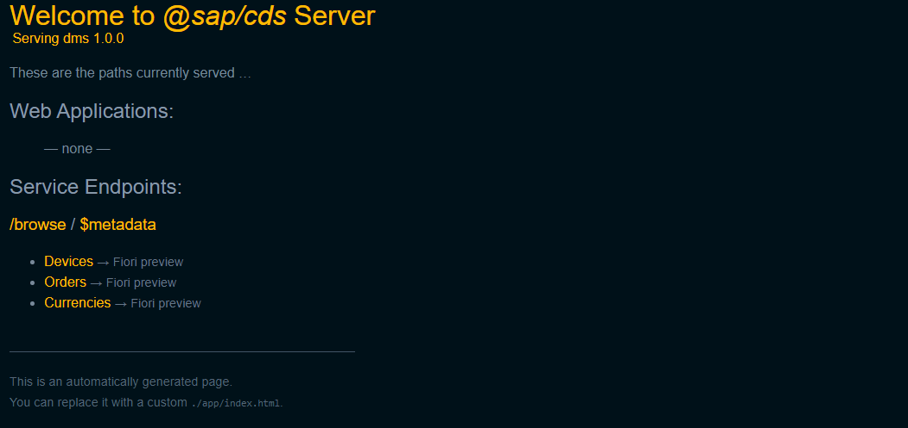

Так, можем проверить, что данные об устройствах из исходного CSV-файла прогрузились корректно, кликнув на "Devices". Должен открыться JSON, в ключе `"value"` которого хранится массив всех устройств:

```json
{
  "@odata.context": "$metadata#Devices",
  "value": [
    {
      "ID":101,
      "name":"Lenovo Thinkpad T480",
      "category":"Laptops",
      "description":"Business laptop",
      "quantity":15,
      "price":740,
      "currency_code":"usd"
    },
    ...
  ]
}
```

Заметим, что в поле `"category"` у каждого устройства автоматом подставилось наименование категории, как мы и определяли в коде сервиса. Также проверим, к каким полям у нас есть доступ в нашем сервисе, щёлкнув на `$metadata` у эндпойнта `/browse`. Убеждаемся, что для модели `Devices` пользователю будут доступны все поля, кроме администраторских `"createdAt"`, `"createdBy"`, `"modifiedAt"` и `"modifiedBy"`:

```xml
<EntityType Name="Devices">
  <Key>
    <PropertyRef Name="ID"/>
  </Key>
  <Property Name="ID" Type="Edm.Guid" Nullable="false"/>
  <Property Name="name" Type="Edm.String" MaxLength="32"/>
  <Property Name="category" Type="Edm.String" MaxLength="16"/>
  <Property Name="description" Type="Edm.String" MaxLength="128"/>
  <Property Name="quantity" Type="Edm.Int32"/>
  <Property Name="price" Type="Edm.Decimal" Scale="2" Precision="5"/>
  <NavigationProperty Name="currency" Type="CatalogService.Currencies">
    <ReferentialConstraint Property="currency_code" ReferencedProperty="code"/>
  </NavigationProperty>
  <Property Name="currency_code" Type="Edm.String" MaxLength="3"/>
  <NavigationProperty Name="texts" Type="Collection(CatalogService.Devices_texts)">
    <OnDelete Action="Cascade"/>
  </NavigationProperty>
  <NavigationProperty Name="localized" Type="CatalogService.Devices_texts">
    <ReferentialConstraint Property="ID" ReferencedProperty="ID"/>
  </NavigationProperty>
</EntityType>
```

Определив сервис, можем приступить к написанию базовой бизнес-логики приложения. Итак, создадим следующий функционал:

* Если у устройства значение `"quantity"` равно нулю, то к значению поля `"name"` прибавлять пометку " -- Currently out of stock"
* При оформлении заказа на n экземпляров устройства, значение поля `"quantity"` устройства уменьшается на n
* Если запрашиваемое n больше, чем значение доступных экземпляров `"quantity"`, то возвращать пользователю сообщение, что требуемого количества экземпляров устройства пока нет ("Currently out of stock").

В папке `/srv` создаём новый файл [`user.js`](./dms/srv/user.js) (наименование то же, что и у файла сервиса). В файле содержится следующий код:

```javascript
// Load the CDS module
const cds = require('@sap/cds');
// Load current data-models from a set of CDS entities
const { Devices } = cds.entities;

// Define service implementation for CatalogService
module.exports = (srv) => {
    // Append the "out of stock" label to devices' names AFTER it's been read and processed
    srv.after('READ', 'Devices', (each) => !each.quantity && _handleOutOfStock(each));
    // Attempt to reduce device's quantity BEFORE creating an order
    // in case the requested quantity is not available
    srv.before('CREATE', 'Orders', _handleDeviceQuantity);
}

// Append the out-of-stock label to the passed device's name
function _handleOutOfStock(device) {
    device.name += ' -- Currently out of stock';
}

// Handle the devices' quantities account on new order
async function _handleDeviceQuantity(req) {
    // Get the order's data (list of ordered devices)
    const order = req.data;
    // Good practice to store a DB transaction in a variable
    const tx = cds.transaction(req);
    // If the list of ordered items is non-empty
    if (order.Items) {
        const affectedRows = await tx.run(order.Items.map(item =>
            // For each device in the order list reduce its stock quantity,
            // if the requested amount is available
            UPDATE(Devices).where({ID: item.device_ID})
                           .and(`quantity >=`, item.quantity)
                           .set(`quantity -=`, item.quantity)
        ));
        // If the requested amount is more than available, inform user
        if (affectedRows.some(row => !row)) req.error(409, 'Currently out of stock');
    }
}
```

Мы постарались снабдить код всеми необходимыми комментариями. Если коротко резюмировать, то мы прописали два правила (хэндлера) при взаимодействии с базой данных для нашего сервиса:

1. _ПОСЛЕ_ обработки всех данных об устройствах (через `each`) добавлять к названию " -- Currently out of stock", если устройства не осталось в наличии (функция [`_handleOutOfStock`](./dms/srv/user.js#L16))
2. _ПЕРЕД_ созданием в базе нового заказа проверять, что в наличии есть запрашиваемое количество по каждому устройству и обновлять количество на складе (функция [`_handleDeviceQuantity`](./dms/srv/user.js#L21)).

Работа первого пункта из заявленного функционала бизнес-логики проверяется относительно легко: после обновления страницы нашего сервера (того, что крутится на localhost:4004), переходим к просмотру данных в `Devices`:

```json
{
  "@odata.context": "$metadata#Devices",
  "value": [
    ...
    {
      "ID":203,
      "name":"Microsoft Surface Pro 7 -- Currently out of stock",
      "category":"Tablets",
      "description":"Whatever your office looks like, be it a cubicle or cafe, new Surface Pro 7 is your ultra-light, endlessly adaptable partner",
      "quantity":0,
      "price":900,
      "currency_code":"usd"
    },
    ...
    {
      "ID":301,
      "name":"Apple iPhone 12 -- Currently out of stock",
      "category":"Smartphones",
      "description":"Backed by a one-year satisfaction guarantee",
      "quantity":0,
      "price":779,
      "currency_code":"usd"
    }
  ]
}
```

Как видим, к названиям обоих устройств, отсутствующих на складе, добавилась нужная пометка.

Проверить второй и третий пункты функционала в браузере мы пока что не можем. Но в Business Application Studio IDE есть встроенный REST-клиент, с помощью которого возможно составлять HTTP-запросы к API нашего приложения по аналогии с [Postman](https://www.postman.com/).

Так как мы, по сути, начинаем тестирование приложения, то нам стоит все файлы, связанные с тестированием, хранить в отдельной папке. Создаём в корне приложения папку `tests/`, там создаём файл [`user.http`](./dms/tests/user.http) и прописываем в нём следующие запросы:

```
@dms = http://localhost:4004
@catalog-service = {{dms}}/browse
# Lenovo Thinkpad T480
@deviceID = 101

### View current status on Lenovo Thinkpad T480
GET {{catalog-service}}/Devices({{deviceID}})

### Create an order for 7 instances of Lenovo Thinkpad T480
POST {{catalog-service}}/Orders
Content-Type: application/json

{ 
    "OrderNr":"1",
    "Items":[{
        "device_ID": {{deviceID}},
        "quantity": 7
    }]
}
```

Запросы в этом клиенте отделяются друг от друга строкой с "###", также поддерживается объявление переменных. При составлении каждого запроса над ним появляется кнопка "Send Request" отправки запроса:

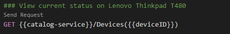

В нашем случае мы составили два запроса к нашему API:

1. Получение актуальной информации об устройстве с идентификатором 101 (Lenovo Thinkpad T480)
2. Размещение заказа, состоящего из семи экземпляров устройства Lenovo Thinkpad T480.

При отправке первого запроса об устройстве мы должны получить отзыв с таким объектом:

```json
{
  "@odata.context":"$metadata#Devices/$entity",
  "ID":101,
  "name":"Lenovo Thinkpad T480",
  "category":"Laptops",
  "description":"Business laptop",
  "quantity":15,
  "price":740,
  "currency_code":"usd"
}
```

Это исходный объект устройства Lenovo Thinkpad T480, который мы подгрузили с CSV-файла. Если мы теперь дважды отправим второй запрос с заказом, то получим следующее:

```json
{
  "@odata.context":"$metadata#Orders(Items())/$entity",
  "ID":"890000d1-06f8-4023-93fd-e41a0bf1e4a0",
  "createdAt":"2022-01-11T18:25:00.545Z",
  "createdBy":"anonymous",
  "modifiedAt":"2022-01-11T18:25:00.545Z",
  "modifiedBy":"anonymous",
  "OrderNr":"1",
  "Items":[
    {
      "ID":"e2bc1661-586f-4a00-ac3a-e9f8f83ed116",
      "parent_ID":"890000d1-06f8-4023-93fd-e41a0bf1e4a0",
      "device_ID":101,
      "quantity":7
    }
  ]
}
```

Оба заказа создались в базе. Если же мы снова отошлём запрос на новый заказ, то получим ошибку — семи экземпляров больше на складе нет:

```json
{
  "error": {
    "code":"409",
    "message":"Currently out of stock",
    "@Common.numericSeverity":4
  }
}
```

Действительно, запросив информацию об устройстве, — первый запрос — видим, что значение поля `"quantity"` обновилось:

```json
{
  "@odata.context":"$metadata#Devices/$entity",
  "ID":101,
  "name":"Lenovo Thinkpad T480",
  "category":"Laptops",
  "description":"Business laptop",
  "quantity":1,
  "price":740,
  "currency_code":"usd"
}
```

Но мы всё ещё можем заказать один экземпляр. Создадим в файле новый запрос

```
### Create an order for a single instance of Lenovo Thinkpad T480
POST {{catalog-service}}/Orders
Content-Type: application/json

{ 
    "OrderNr":"2",
    "Items":[{
        "device_ID": {{deviceID}},
        "quantity": 1
    }]
}
```

и отошлём его:

```json
{
  "@odata.context":"$metadata#Orders(Items())/$entity",
  "ID":"53337609-b6af-498d-81e5-43942a406e4e",
  "createdAt":"2022-01-31T02:54:58.640Z",
  "createdBy":"anonymous",
  "modifiedAt":"2022-01-31T02:54:58.640Z",
  "modifiedBy":"anonymous",
  "OrderNr":"2",
  "Items":[
    {
      "ID":"bf40a745-7cf7-40b7-847b-e8b5d38ffa4e",
      "parent_ID":"53337609-b6af-498d-81e5-43942a406e4e",
      "device_ID":101,
      "quantity":1
    }
  ]
}
```

Успешно создан ещё один заказ на один экземпляр. Проверяем информацию об устройстве через первый запрос:

```json
{
  "@odata.context":"$metadata#Devices/$entity",
  "ID":101,
  "name":"Lenovo Thinkpad T480 -- Currently out of stock",
  "category":"Laptops",
  "description":"Business laptop",
  "quantity":0,
  "price":740,
  "currency_code":"usd"
}
```

Так как количество экземпляров на складе достигло нуля (`"quantity":0`), то к наименованию устройства добавилась метка "Currently out of stock".

### Для администраторов
<a name="services-admins"></a>
<!-- 5-02 -->

Сервис для администраторов пока что сделаем очень простым — предоставим полный доступ на чтение и запись ко всем основным моделям. Итак, создаём в `srv/` файл [`admin.cds`](./dms/srv/admin.cds):

```
// Import the project schema containing all the models
using { sap.capire.dms as dms } from '../db/schema';

// Define catalog service on route "/admin"
service AdminService @(path:'admin') {
    // Require user authorization
    @requires_:'authenticated-user'
    // Allow full access to the main entities
    entity Devices as projection on dms.Devices;
    entity Categories as projection on dms.Categories;
    entity Orders as select from dms.Orders;
}
```

На данном этапе для доступа к сервису потребуем от пользователя лишь аутентификацию (`@requires_:'authenticated-user'`), но в [последующих разделах](#auth) мы обязательно настроим должное разграничение прав через авторизацию. Обновив страницу сервера, видим, что появился новый эндпоинт "/admin", и что в нём доступны объекты нашей модели:

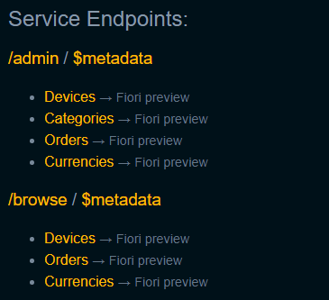

Если мы вернёмся в `user.http` и создадим несколько заказов, то сможем просмотреть созданные записи на сервере в `Orders` под эндпоинтом "/admin":

```json
{
  "@odata.context":"$metadata#Orders",
  "value":[
    {
      "ID":"3a356540-e160-49b9-8de7-4a869d7c3d3b",
      "createdAt":"2022-01-12T09:44:15.147Z",
      "createdBy":"anonymous",
      "modifiedAt":"2022-01-12T09:44:15.147Z",
      "modifiedBy":"anonymous",
      "OrderNr":"1"
    },
    {
      "ID":"49906918-4db9-4733-9197-e3e9e89d5f8c",
      "createdAt":"2022-01-12T09:44:19.156Z",
      "createdBy":"anonymous",
      "modifiedAt":"2022-01-12T09:44:19.156Z",
      "modifiedBy":"anonymous",
      "OrderNr":"1"
    },
    {
      "ID":"1bf56087-41b9-4f6d-bfb2-908afbe57b2f",
      "createdAt":"2022-01-12T09:44:24.143Z",
      "createdBy":"anonymous",
      "modifiedAt":"2022-01-12T09:44:24.143Z",
      "modifiedBy":"anonymous",
      "OrderNr":"2"
    }
  ]
}
```

В эндпоинте "/browse" мы этого сделать не смогли:

```xml
<error xmlns="http://docs.oasis-open.org/odata/ns/metadata">
  <code>405</code>
  <message>Entity "CatalogService.Orders" is insert-only</message>
  <annotation term="Common.numericSeverity" type="Edm.Decimal">4</annotation>
</error>
```

так как в том сервисе на модель "Orders" мы дали права только на запись (через аннотацию `@insertonly`).

## Настройка постоянной базы данных
<a name="databases"></a>
<!-- 6 -->

Теперь, когда первые шаги по созданию приложения уже сделаны, можно начать развёртывать нашу базу данных не в памяти, а в файлах. В этом разделе мы рассмотрим создание и настройку БД в SQLite и в SAP HANA.

### SQLite
<a name="databases-sqlite"></a>
<!-- 6-01 -->

В терминале вызываем следующую CDS команду:

```sh
$ cds deploy --to sqlite:dms.db
```

Во-первых, в корневой папке проекта создался файл с SQLite БД "dms.db" — имя, которое мы указали в команде. Во-вторых, обновился файл ["package.json"](./dms/package.json#L47) — в его конец добавилась конфигурация CDS с требованием развёртывания базы данных на SQLite:

```json
"cds": {
  "requires": {
    "db": {
      "kind": "sqlite",
      "credentials": {
        "database": "dms.db"
      }
    }
  }
}
```

Поле `"db"` здесь лишь имя datasource-а и может быть произвольным. Также заметим, что наши импортируемые данные из CSV файлов автоматически подхватились при развёртывании БД (так как имена этих файлов следовали необходимому шаблону):

```sh
 > filling sap.capire.dms.Categories from ./db/data/sap.capire.dms-Categories.csv
 > filling sap.capire.dms.Devices from ./db/data/sap.capire.dms-Devices.csv
```

Для просмотра сгенерированного файла базы данных в SAP Business Application Studio включён SQL редактор SQLTools:

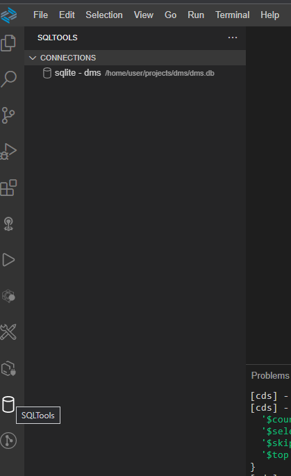

Из коробки он работает с базами данных, которые пользователь загрузил из своей системы, но в настройках можно явно прописать соединение для файла в облачной Web IDE. Заходим в `File > Preferences > Open Preferences` (или через горячие клавиши `Ctrl+,`), набираем в поисковике "SQLTools", выбираем в списке найденных дополнений "Sqltools" и кликаем "Edit in settings.json" в разделе "Connections":

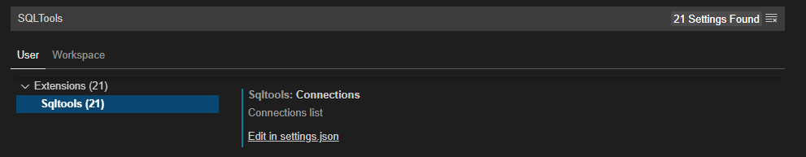

Заполняем поле `"sqltools.connections"` в конце файла `settings.json`, указав имя соединения, тип СУБД (SQLite — автодополнение само предложит на выбор доступные варианты) и путь к самому файлу (если мы вдруг забыли полный путь к папке проекта, то его можно посмотреть в терминале при помощи команды `$ pwd`):

```json
"sqltools.connections": [
    {
        "name": "sqlite - dms",
        "dialect": "SQLite",
        "database": "/home/user/projects/dms/dms.db"
    }
]
```

Перейдя в SQLTools после сохранения `settings.json`, видим, что во вкладке "Connections" появилось доступное соединение "sqlite - dms". Можем теперь открыть файл нашей SQLite базы, щёлкнув правой кнопкой мыши по соединению "sqlite - dms" и нажав "Connect":

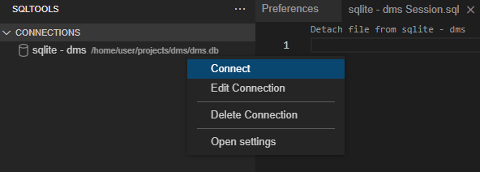

После подключения нам будут доступны все таблицы и представления нашей БД. Так, развернув папку "tables", убедимся, что данные из CSV файлов были загружены в таблицы. Щёлкнем правой кнопкой мыши на, к примеру, таблицу с устройствами ("sap_capire_dms_Devices"), затем "Show Table Records" — таблица с существующими записями об устройствах откроется в новой вкладке:

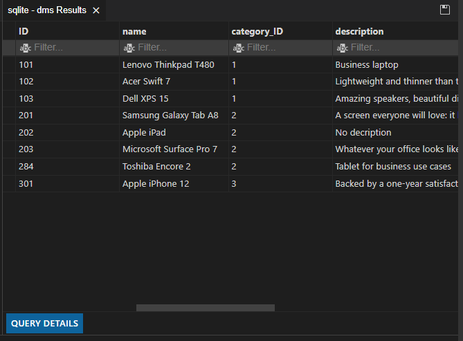

Кстати, заметим, что в списке таблиц есть таблицы вида "sap_capire_dms_Devices_texts". Они были автоматически сгенерированы по нашим схемам, так как в их определениях участвует модификатор `localized` (подробности см. [раздел по локализации динамических данных](#local-dynamic)).

### SAP HANA
<a name="databases-hana"></a>
<!-- 6-02 -->

Для развёртывания базы данных в SAP HANA нам необходимо сперва войти в окружение CloudFoundry:

```sh
$ cf login
```

Для входа потребуется указать:
* API эндпоинт, который можно скопировать из сабаккаунта ("trial") на SAP Business Technology Platform
* Адрес электронной почты, под которым мы зашли на SAP BTP
* Пароль.

Поскольку мы уже проделали [всю подготовительную работу по развёртыванию SAP HANA в нашей среде разработки](#prep-hana), то сейчас нам достаточно запустить

```sh
$ cds deploy --to hana
```

На этот раз вывод команды гораздо длиннее; в частности, в фоне запускается утилита `cf`. По сути, запускаемая команда создаёт сервис в окружении "dev", который содержит в себе необходимую схему для взаимодействия с SAP HANA:

```sh
[cds.deploy] - Running 'cf create-service hana hdi-shared dms-database' with options {}
Creating service instance dms-database in org a00ed6d1trial / space dev as artemy.gevorkov@sap.com...
OK
```

После успешного развёртывания в папке сгенерится, в частности, файл `default-env.json`, в котором содержатся все необходимые данные для подключения к SAP HANA **(храните этот файл в безопасном месте!)**. Рекомендуется также дополнительно установить актуальные модули для работы с HANA:

```sh
$ npm i hdb "@sap/hana-client"
```

Наконец, рекомендуется настроить приложение так, чтобы в среде production оно автоматически развёртывалось в БД SAP HANA. Для этого подредактируем [`package.json`](./dms/package.json#L54), добавив в словарь `"cds"."requires"."db"` новую среду "prod", при активации которой тип используемой базы данных переключится с SQLite на HANA. В результате этих манипуляций значение объекта `"cds"` примет вид

```json
"cds": {
  "requires": {
    "db": {
      "kind": "sqlite",
      "credentials": {
        "database": "dms.db"
      },
      "[prod]": {
        "kind": "hana"
      }
    }
  },
  "hana": {
    "deploy-format": "hdbtable"
  }
}
```

Чтобы теперь запустить приложение в среде "prod" и проверить его работу с HANA, явно установим переменную среды `CDS_ENV` и начнём watcher:

```sh
$ CDS_ENV=prod cds watch
```

По выводу команды понимаем, что наше приложение теперь развёрнуто в SAP HANA:

```sh
[cds] - connect to db > hana {
  ...
}
```

Можем протестировать базу сохранёнными HTTP-запросами из папки `tests/`.

## Аутентификация и Авторизация
<a name="auth"></a>
<!-- 7 -->

Разграничим теперь доступ к разным сервисам приложения, внедрив функционал проверки типа пользователя.

### Аннотации для разграничения доступа к модели
<a name="auth-annotations"></a>
<!-- 7-01 -->

В коде наших сервисов мы уже использовали аннотацию `@requires`, в которую можно передавать типы пользователей, получающих доступ к сервису. Общий шаблон использования этой аннотации выглядит так:

```
service ServiceName @(requires:<roles>) {
    ...
}
```


Из коробки в модели CAP доступно три типа (_pseudo roles_) для пользователя:
* "authenticated-user" — пользователь, который зашёл в приложение по токену аутентификации;
* "system-user" — безымянный пользователь, который используется для внутренних коммуникаций в приложении (то есть, он предоставляет внутренний доступ);
* "any" — любой пользователь (в том числе и анонимный), открывший приложение.

Ниже мы продемонстрируем, как создать и настроить свой тип пользователя на примере типа для администратора.

В модели CDS существует также аннотация `@restrict`, позволяющая описывать более сложные правила под каждый запрос (`CREATE`, `READ`, `UPDATE` и `DELETE`) к базе данных. Таким образом, данная аннотация позволяет регулировать доступ на уровне определений (а не на уровне сервисов, как это делает `@requires`). Например, предоставить обычному пользователю право на просмотр заказов (`Orders`), но распространить его только на заказы, созданные конкретно этим пользователем, можно таким правилом:

```
entity Orders @restrict: [{
    grant: 'READ', to: 'authenticated-user', where: 'createdBy = $user'
}]
```

Итак, явно пропишем это правило, добавив следующую аннотацию для пользовательского сервиса в [`srv/user.cds`](./dms/srv/user.cds#L16):

```
// Allow users to view and edit only the orders they created
annotate CatalogService.Orders with 
    @restrict: [
        {grant: 'READ', to: 'authenticated-user', where: 'createdBy = $user'},
        {grant: 'UPDATE', to: 'authenticated-user', where: 'createdBy = $user'}
    ];
```

В самом же `CatalogService` теперь можно убрать аннотацию `@insertonly` перед объявлением `Orders`, — мы уже определили для пользователя необходимые правила на чтение.

Пропишем аннотацию для взаимодействия с заказами и в админском сервисе: открываем [`srv/admin.cds`](./dms/srv/admin.cds#L14) и по аналогии добавляем нужное правило

```
// Restrict access to orders to users with role "admin"
annotate AdminService.Orders with 
    restrict: [
        {grant: '*', to: 'admin'}
    ];
```

Заметим, что `'*'` означает любой из четырёх CRUD запросов, а `'admin'` — новый тип пользователя, который мы сами определили.

Если мы теперь перейдём на страницу сервера и в эндпоинте "/browse" попробуем посмотреть `Orders`, то браузер должен запросить логин и пароль. То же самое произойдёт и при попытке просмотра `Orders` в эндпоинте "/admin".

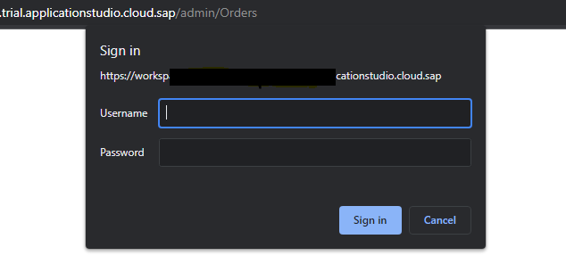

Поэтому самое время создать и прописать пользователей для полноценного тестирования.

### Тестирование на mock-пользователях
<a name="auth-mock"></a>
<!-- 7-02 -->

Для создания mock-пользователей нам необходимо установить модуль `passport`:

```sh
$ npm i passport
```

После установки можем описать пользователей и присвоить им разные типы, добавив в файл [`.cdsrc.json`](./dms/.cdsrc.json) объект `"auth"`:

```json
"auth": {
    "passport": {
        "strategy": "mock",
        "users": {
            "admin": {
                "ID": "admin",
                "password": "admin",
                "roles": [
                    "admin",
                    "authenticated-user"
                ]
            },
            "user": {
                "ID": "user",
                "password": "user",
                "roles": [
                    "authenticated-user"
                ]
            }
        }
    }
}
```

По объекту `"users"` видим, что мы добавили двух пользователей: "admin" и "user" с соответствующими правами. Теперь мы сможем получить доступ к `Orders` по входу `"admin"/"admin"` и `"user"/"user"` соответственно:

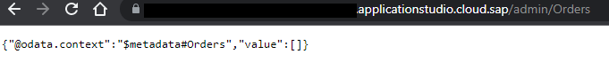

Упомянем, что также возможно проверять аутентификацию и права пользователя вручную в файлах бизнес-логики. Например, проверка того, что пользователь, открывший сервис, "залогинен" может выглядеть так:

```javascript
srv.before(['CREATE', 'READ'], 'Orders', req => 
    req.user.is('authenticated-user') || req.reject(403, "Authentication required"))
```

А проверка того, что пользователь является администратором, так:

```javascript
srv.before(['UPDATE', 'DELETE'], 'Orders', req => 
    req.user.is('admin') || req.reject(403, "Administrative rights required"))
```

### Интеграция с SAP Cloud Platform
<a name="auth-scp"></a>
<!-- 7-03 -->

Рассмотрим теперь процесс интеграции CAP модели в среду SAP Cloud Platform. Для функционала аутентификации и авторизации необходима связь с CloudFoundry XSUAA (eXtended Services for User Account and Authentication). В этой инструкции мы не станем подробно углубляться в теорию по XSUAA, но обозначим, что они являются одной из основных частей инфраструктуры среды CloudFoundry для SAP BTP, которая осуществляет авторизацию для приложений в среде SAP Cloud Platform. В частности, XSUAA позволят нашему приложению идентифицировать пользователя по имени, ID или адресу e-mail, а также осуществлять проверку его прав при взаимодействии с приложением.

Для всего этого нам не потребуется что-либо менять в коде приложения, CAP модель позволяет разработчикам сгенерировать необходимые настройки связей между созданными сервисами и XSUAA. Эти настройки генерируются в формате JSON CLI-утилитой `cds`, и мы сразу запишем их в файл `xs-security.json`:

```sh
cds compile srv/ --to xsuaa > xs-security.json
```

Открыв созданный файл [`xs-security.json`](./dms/xs-security.json), видим, что автоматически подхватился определённый нами тип пользователя "admin":

```json
{
  "xsappname": "dms",
  "tenant-mode": "dedicated",
  "scopes": [
    {
      "name": "$XSAPPNAME.admin",
      "description": "admin"
    }
  ],
  "attributes": [],
  "role-templates": [
    {
      "name": "admin",
      "description": "generated",
      "scope-references": [
        "$XSAPPNAME.admin"
      ],
      "attribute-references": []
    }
  ]
}
```

Эти настройки можно будет указать в дескрипторе MTA, передав путь к `xs-security.json`. Но сперва необходимо явно прописать в настройке CDS, что мы будем использовать XSUAA. Для этого добавим в [`package.json`](./dms/package.json#L58) к `"cds"."requires"` соответствующую запись:

```json
"uaa": {
    "kind": "xsuaa"
}
```

Для развёртывания приложения на SAP Cloud Platform через CloudFoundry нам нужен сам дескриптор MTA `mta.yaml`. Его можно сгенерировать следующей командой:

```sh
$ cds add mta
```

Как упоминалось выше в созданном дескрипторе к сервису "xsuaa" для сгенерированного ресурса "dms-uaa" (в конце файла `mta.yaml`) следует явно прописать путь к файлу с настройками (`path: ./xs-security.json`). Таким образом ресурс "dms-uaa" в [`mta.yaml`](./dms/mta.yaml#L43) преобразовывается в следующий вид:

```yaml
resources:
 # services extracted from CAP configuration
 # 'service-plan' can be configured via 'cds.requires.<name>.vcap.plan'
# ------------------------------------------------------------
 - name: dms-uaa
# ------------------------------------------------------------
   type: org.cloudfoundry.managed-service
   parameters:
     path: ./xs-security.json
     service: xsuaa
     service-plan: application  
     config:
       xsappname: dms-${space}    #  name + space dependency
       tenant-mode: dedicated

```

Далее нужно сгенерировать архив MTAR нашего приложения для последующего деплоя его на CloudFoundry. На всякий случай проверим обновления модулей и "заморозим" версии всех модулей в `package-lock.json`:

```sh
$ npm update --package-lock-only
```

Сама генерация архива запускается командой

```sh
$ mbt build
```

По итогу в папке `mta_archives` создастся архив `dms-1.0.0.mtar`. Нам остаётся только задеплоить его на CloudFoundry:

```sh
$ cf login
$ cf deploy mta_archives/dms_1.0.0.mtar
```

Если мы по завершению процесса перейдём в наш trial-аккаунт на SAP BTP Cockpit, то увидим, что в списке Service Instances нашей среды разработки "dev" появился новый сервис "dms-uaa", который связывает приложение с XSUAA и регулирует проверку  передаваемых JWT-токенов:

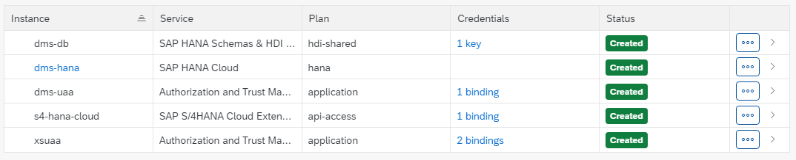

Вдобавок к этому, если мы перейдём в SAP BTP Cockpit в Security > Role Templates для самого приложения, то найдём там сгенерированный шаблон "admin", подхваченный CDS при создании файла `xs-security.json`:

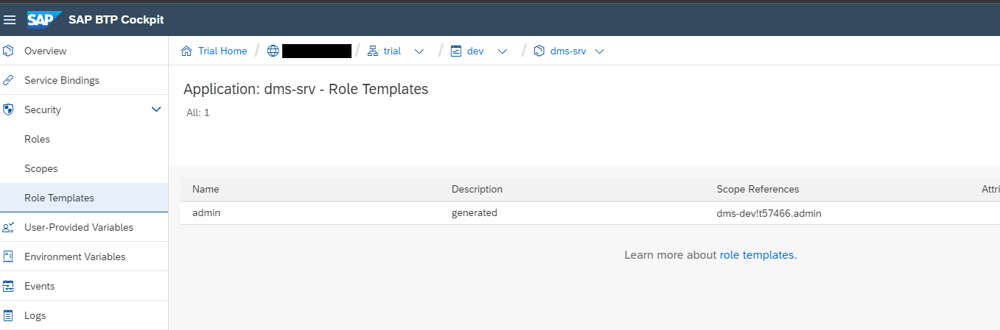

В зависимости от типов пользователей, которых мы определили в нашей CAP модели и которые были подхвачены при генерации `xs-security.json`, будет возможно тщательно настроить пользователь и их права в вкладке Security > Roles прямо из SAP BTP Cockpit.

## Создание фронтенда
<a name="ui"></a>
<!-- 8 -->

Для конкретно этого примера мы создадим фронтенд нашего приложения с помощью технологии SAP Fiori. Однако напомним, что CAP модель очень адаптивна и гибка, поэтому UI можно создавать на любом фреймворке. Сразу же обозначим, что мы не станем подробно останавливаться на самом SAP Fiori, так как для более или менее полноценного обзора этой технологии понадобится отдельная инструкция, сопоставимая по объёму с этим README.

Итак, мы хотим создать три отдельные страницы:

1. Каталог устройств (для обычных пользователей)
2. Управление устройствами (для администраторов)
3. Управление заказами (для администраторов).

Для этого в Fiori создадим три отдельных приложения (apps). В данном разделе мы сосредоточимся на создании приложения для первой страницы — каталога устройств. Мы пройдёмся по основным принципам работы и самому коду фронтенда.

Итак, все файлы для UI должны храниться в папке `app/`. Сперва нам нужно создать файл с перечислением необходимых аннотаций — того, к каким атрибутам каких объектов и в каких секциях страницы у фронтенда будет доступ. Создаём файл [`common.cds`](./dms/app/common.cds) и перечисляем в нём необходимые аннотации:

```
/*
  Set of common annotations shared by all apps
*/

// Import the project schema containing all the models
using { sap.capire.dms as dms } from '../db/schema';

//  Devices Lists
annotate dms.Devices with @(
  UI: {
    Identification: [{Value:name}],
      SelectionFields: [ ID, name, category_ID, quantity, price, currency_code ],
    LineItem: [
      {Value: ID, Label: 'ID'},
      {Value: name, Label: 'Name'},
      {Value: category_ID.name, Label:'Category'},
      {Value: quantity, Label: 'Quantity'},
      {Value: price, Label: 'Price'},
      {Value: currency_code}
    ]
  }
) 
{
  category @ValueList.entity:'Categories';
};

annotate dms.Categories with @(
  UI: {
    Identification: [{Value:name, Label: 'Name'}],
  }
);

//  Devices Details
annotate dms.Devices with @(
  UI: {
    HeaderInfo: {
      TypeName: 'Device',
      TypeNamePlural: 'Devices',
      Title: {Value: name, Label: 'Name'},
      Description: {Value: category.name, Label: 'Category'}
    },
  }
);

//  Devices elements
annotate dms.Devices with {
  ID @title:'ID' @UI.HiddenFilter;
  name @title:'Name';
  category @title:'CategoryID';
  price @title:'Price';
  quantity @title:'Quantity';
  description @UI.MultiLineText;
}

//  Categories elements
annotate dms.Categories with {
  ID @title:'ID' @UI.HiddenFilter;
  name @title:'Category';
}
```

Например, первая аннотация для устройств чётко определяет, что устройства должны отображаться в таблице с атрибутами "ID", "name", "category_ID", "quantity", "price" и "currency_code" и с соответствующими колонками.

Далее, создаём в папке `app/` новую папку `browse/`, в которой будем хранить код приложения для страницы каталога. В этой папке создаём отдельный файл [`fiori-service.cds`](./dms/app/browse/fiori-service.cds) с аннотациями уже для конкретно этой страницы:

```
/*
  Annotations for the "browse" app
*/

// Import CatalogService from the file containing user services
using CatalogService from '../../srv/user';

// Devices list
annotate CatalogService.Devices with @(
  UI: {
    SelectionFields: [ category, price ],
    LineItem: [
      {Value: name, Label: 'Name'},
      {Value: category, Label: 'Category'},
      {Value: quantity, Label: 'Quantity'},
      {Value: price, Label:'Price'}
    ]
  }
);

//  Devices object page
annotate CatalogService.Devices with @(
  UI: {
    HeaderInfo: {
      Description: {Value: category}
    },
    HeaderFacets: [
      {$Type: 'UI.ReferenceFacet', Label: 'Description', Target: '@UI.FieldGroup#Descr'},
    ],
    Facets: [
      {$Type: 'UI.ReferenceFacet', Label: 'Details', Target: '@UI.FieldGroup#Price'},
    ],
    FieldGroup#Descr: {
      Data: [
        {Value: description, Label: 'Description'},
      ]
    },
    FieldGroup#Price: {
      Data: [
        {Value: price, Label: 'Price'},
        {Value: currency_code, Label: 'Currency'},
      ]
    },
  }
);
```

В этом файле мы явно прописали аннотации для отображения устройств в таблице (колонки, фильтры) и отображения отдельного устройства в детальном режиме.

Создаём папку `webapp/` и создаём в ней два файла [`manifest.json`](./dms/app/browse/webapp/manifest.json) и [`Component.js`](./dms/app/browse/webapp/Component.js). Так как мы используем Fiori, то вся логика нашего UI может быть прописана в [`manifest.json`](./dms/app/browse/webapp/manifest.json):

```json
{
  "_version": "1.0.0",
  "sap.app": {
    "id": "DeviceManagementSystem",
    "type": "application",
    "title": "Browse Devices",
    "description": "Sample Application",
    "i18n": "i18n/i18n.properties",
    "dataSources": {
      "CatalogService": {
        "uri": "/browse/",
        "type": "OData",
        "settings": {
          "odataVersion": "4.0"
        }
      }
    },
    "-sourceTemplate": {
      "id": "ui5template.basicSAPUI5ApplicationProject",
      "-id": "ui5template.smartTemplate",
      "-version": "1.40.12"
    }
  },
  "sap.ui5": {
    "dependencies": {
      "libs": {
        "sap.fe.core": {},
        "sap.fe.macros": {},
         "sap.fe.templates": {}
      }
    },
    "models": {
      "i18n": {
        "type": "sap.ui.model.resource.ResourceModel",
        "uri": "i18n/i18n.properties"
      },
      "": {
        "dataSource": "CatalogService",
        "settings": {
          "synchronizationMode": "None",
          "operationMode": "Server",
          "autoExpandSelect": true,
          "earlyRequests": true,
          "groupProperties": {
            "default": {
              "submit": "Auto"
            }
          }
        }
      }
    },
    "routing": {
      "routes": [
        {
          "pattern": ":?query:",
          "name": "DevicesList",
          "target": "DevicesList"
        },
        {
          "pattern": "Devices({key}):?query:",
          "name": "DevicesDetails",
          "target": "DevicesDetails"
        }
      ],
      "targets": {
        "DevicesList": {
          "type": "Component",
          "id": "DevicesList",
          "name": "sap.fe.templates.ListReport",
          "options": {
            "settings": {
              "entitySet": "Devices",
              "navigation": {
                "Devices": {
                  "detail": {
                    "route": "DevicesDetails"
                  }
                }
              }
            }
          }
        },
        "DevicesDetails": {
          "type": "Component",
          "id": "DevicesDetailsList",
          "name": "sap.fe.templates.ObjectPage",
          "options": {
            "settings": {
              "entitySet": "Devices"
            }
          }
        }
      }
    },
    "contentDensities": {
      "compact": true,
      "cozy": true
    }
  },
  "sap.ui": {
    "technology": "UI5",
    "fullWidth": false
  },
  "sap.fiori": {
    "registrationIds": [],
    "archeType": "transactional"
  }
}
```

и затем подхвачена в виде метаданных в [`Component.js`](./dms/app/browse/webapp/Component.js):

```javascript
sap.ui.define(["sap/fe/core/AppComponent"], ac => 
    ac.extend("dms.Component", { 
        metadata:{ manifest:'json' }
    })
);
```

Возвращаясь в папку `app/`, создаём там файл [`index.cds`](./dms/app/index.cds), в котором мы импортируем только что созданный сервис приложения страницы "/browse":

```
// Model definitions to serve to Fiori frontend

using from './common';
// Load the '/browse' app
using from './browse/fiori-service';
```

Наконец, создаём для модели CAP точку входа в наш UI, где через плитки можно будет выбрать страницу. Итак, в `app/` создаём точку входа [`fiori.html`](./dms/app/fiori.html):

```html
<!DOCTYPE html>
<html>
    <head>
        <meta http-equiv="X-UA-Compatible" content="IE=edge" />
        <meta http-equiv="Content-Type" content="text/html;charset=UTF-8" />
        <meta name="viewport" content="width=device-width, initial-scale=1.0" />
        <title>Device Management System (DMS)</title>

        <script>
            window["sap-ushell-config"] = {
                defaultRenderer: "fiori2",
                applications: {
                    "browse-devices": {
                        title: "Browse devices",
                        description: "View the list of available devices",
                        additionalInformation: "SAPUI5.Component=dms",
                        applicationType : "URL",
                        url: "/browse/webapp",
                        navigationMode: "embedded"
                    }
                }
            };
        </script>

        <script src="https://sapui5.hana.ondemand.com/test-resources/sap/ushell/bootstrap/sandbox.js"></script>
        <script src="https://sapui5.hana.ondemand.com/resources/sap-ui-core.js"
            data-sap-ui-libs="sap.m, sap.ushell, sap.collaboration, sap.ui.layout"
            data-sap-ui-compatVersion="edge"
            data-sap-ui-theme="sap_fiori_3"
            data-sap-ui-frameOptions="allow"
        ></script>
        <script>
            sap.ui.getCore().attachInit(() => sap.ushell.Container.createRenderer().placeAt("content"))
        </script>
    </head>
    <body class="sapUiBody" id="content">
    </body>
</html>
```

Основное, что нас интересует, это словарь `applications`, в котором мы перечисляем доступные приложения, названия и пути к нему. Таким образом мы создали фронтенд для просмотра устройств.

Если мы перейдём на страницу CDS сервера, то увидим, что в разделе "Web Applications" появилась ссылка на `fiori.html` — наша точка входа.

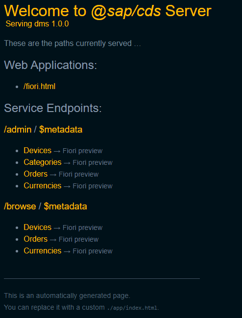

Щёлкнув по ней, мы окажемся в меню, где можно выбрать страницу; так как мы пока написали UI только для одной страницы, то выбор невелик:

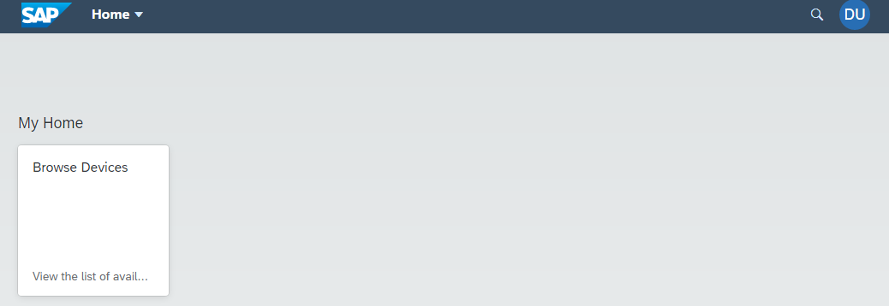

По плитке "Browse Devices" переходим на страницу со списком устройств и фильтром по нему. По умолчанию список ждёт фильтров; чтобы отобразить все устройства, достаточно щёлкнуть по лупе в поле "Search":

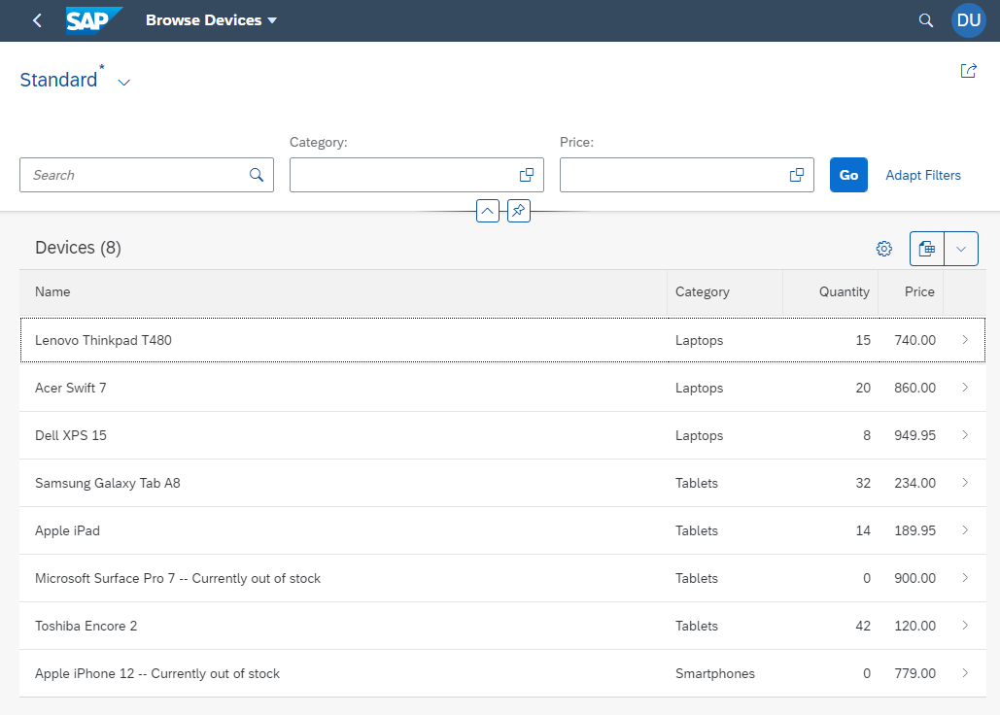

После клика по любому устройству должна загрузиться страница с информацией по этому устройству, в соответствии с теми атрибутами, которые мы определили во второй аннотации в [`fiori-service.cds`](./dms/app/browse/fiori-service.cds#L21):

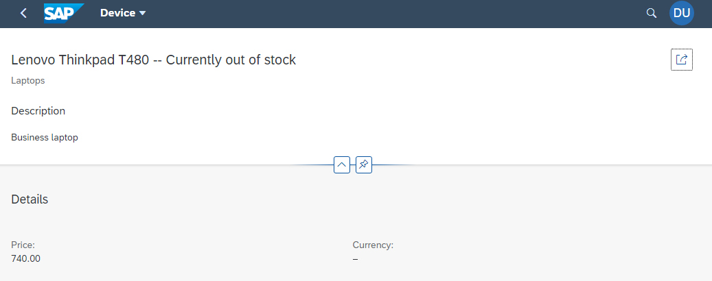

Остальные две страницы разрабатываются аналогично, и их код можно посмотреть в [папке приложения](./dms/app/). Целью этого раздела была демонстрация основных принципов разработки фронтенда с использованием технологий SAP CAP и SAP Fiori.

## Локализация
<a name="local"></a>
<!-- 9 -->

Технический процесс адаптации и перевода текстов в бизнес-приложениях под разные языки обычно происходит в два этапа:

1. Перевод статичных данных (таких, как заголовки и кнопки в UI)
2. Перевод динамичных данных (таких, как наименования категорий устройств и описания самих устройств).

В модели CAP реализации этих двух этапов существенно различаются, поэтому есть полный смысл рассмотреть их по отдельности.

### Статические данные
<a name="local-static"></a>
<!-- 9-01 -->

Процесс локализации заголовков, текстов кнопок и других элементов разработки в CAP мало чем отличается от того, как это происходит в обычной веб-разработке. В папке `app/` создаётся папка `_i18n`, в которой будут храниться файлы с переводами всех статичных данных нашего интерфейса. Для примера создадим файлы с переводами нескольких текстов статических элементов интерфейса:

* `i18n.properties`, содержащие тексты по умолчанию (на английском)
* `i18n_ru.properties`, содержащие тексты на русском.

[`app/_i18n/i18n.properties`](./dms/app/_i18n/i18n.properties):
```
ID = ID
Device = Device
Devices = Devices
Name = Name
Category = Category
Categories = Categories
CategoryID = Category ID
CategoryName = Category's Name
Quantity = Quantity
Price = Price
Order = Order
Orders = Orders
Description = Description
Details = Details
```

[`app/_i18n/i18n_ru.properties`](./dms/app/_i18n/i18n_ru.properties):
```
ID = Идентификатор
Device = Устройство
Devices = Устройства
Name = Название
Category = Категория
Categories = Категории
CategoryID = Идентификатор категории
CategoryName = Название категории
Quantity = Доступно
Price = Цена
Order = Заказ
Orders = Заказы
Description = Описание
Details = Дополнительная информация
```

Теперь достаточно в аннотациях, где явно прописаны метки (labels), обращаться к текстам через i18n. Так, например, аннотация из файла [`app/common.cds`](./dms/app/common.cds#L56), отвечающая за отображение имени фильтра по категориям:

```
// Categories elements
annotate dms.Categories with {
  ID @title:'ID' @UI.HiddenFilter;
  name @title:'Category';
}
```

переделывается в

```
// Categories elements
annotate dms.Categories with {
  ID @title:'{i18n>ID}' @UI.HiddenFilter;
  name @title:'{i18n>Category}';
}
```

Как только это действие будет проделано для всех меток, можно посмотреть, как страницы теперь отображается на русской локали. Перейдя в веб-приложение `fiori.html`, можно добавить в адресной строке параметр `sap-language=ru`. Так, ссылка вида

```
https://<workspace>.applicationstudio.cloud.sap/fiori.html
```

примет вид

```
https://<workspace>.applicationstudio.cloud.sap/fiori.html?sap-language=ru
```

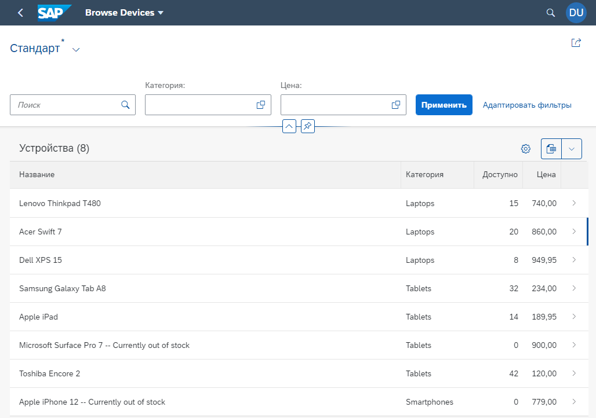

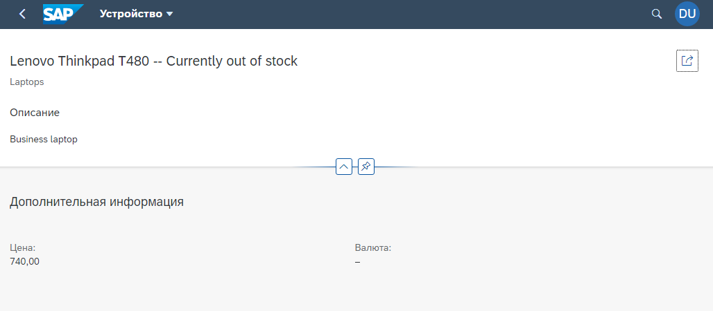

### Динамические данные
<a name="local-dynamic"></a>
<!-- 9-02 -->

Напомним, что при [определении моделей приложения](#models) для некоторых атрибутов использовался модификатор `localized`. В частности, для атрибута `"name"` объектов `Categories` и для атрибута `"description"` объектов `Devices`. По сути, данный модификатор в фоне создаёт для атрибута отдельную таблицу с текстовыми значениями. 

На примере `Categories` понаблюдаем, что происходит "под капотом" у CDS, когда в объекте присутствует модификатор `localized`. Итак, определение в `schema.cds` выглядит так:

```
entity Categories : cuid {
    name: localized String(16);
    devices: Association to many Devices on devices.category = $self;
}
```

Сначала по этому определению CDS генерирует новый объект `Categories_texts`:

```
define entity Categories_texts @(cds.autoexpose) {
    key locale: String(14);
    key ID: UUID;  // source entity's primary key
    name: String(16);
}
```

Далее в исходный объект `Categories` добавляется связь с созданным `Categories_texts` через атрибуты `localized` и `texts`:

```
extend entity Categories with {
    localized: Association to Categories_texts on localized.ID=ID 
               and localized.locale=$user.locale;
    texts: Composition of many Categories_texts on texts.ID=ID;
}
```

Поясним, что обращение к `$user.locale` выдаёт выбранный пользователем язык приложения. Напоследок CDS создаёт в базе данных виды для отображения текста на языке по умолчанию:

```
define entity localized.Categories as SELECT from Categories (*,
    coalesce (localized.name, name) as name
);
```

Имея представление о принципе работы локализации динамических данных, можем теперь загружать файлы с переводами. Напомним, мы хотим, чтобы в зависимости от выбранного языка (английского или русского) переводились наименования категорий и описания устройств. Учитывая устройство работы CDS "под капотом", которое мы описали выше, а также метод загрузки исходных данных, показанный в разделе [Создание моделей (с локализацией)](#models-upload) переводы следует хранить в файлах `sap.capire.dms-Categories_texts.csv` и `sap.capire.dms-Devices_texts.csv`. Итак, поместим в папку `db/data/` следующие CSV файлы с теми заголовками, которые CDS использует для генерации текстовых таблиц:

[`db/data/sap.capire.dms-Categories_texts.csv`](./dms/db/data/sap.capire.dms-Categories_texts.csv):
```
ID;locale;name
1;ru;Ноутбуки
2;ru;Планшеты
3;ru;Смартфоны
```

[`db/data/sap.capire.dms-Devices_texts.csv`](./dms/db/data/sap.capire.dms-Devices_texts.csv):
```
ID;locale;description
101;ru;Ноутбук для бизнеса
102;ru;Более легковесный и тонкий по сравнению с обычными ноутбуками
103;ru;Впечатляющие динамики, прекрасный экран и удобная клавиатура
201;ru;Великолепный экран, передающий самые лучшие цвета на 10.5" LCD мониторе
202;ru;Описание отсутствует
203;ru;Независимо от того, где вы работаете, Surface Pro 7 станет для вас сверх-лёгким и гибким помощником
284;ru;Планшет для бизнес-задач
301;ru;Прилагается годовая гарантия
```

После этого необходимо повторно развернуть базу данных. В качестве теста мы это проделаем для SQLite и перезапустим watcher:

```sh
$ cds deploy --to sqlite:dms
$ cds watch
```

В выводе первой команды видим, что файлы с переводами успешно подхватились в нашей базе данных:

```sh
 > filling sap.capire.dms.Categories from ./db/data/sap.capire.dms-Categories.csv 
 > filling sap.capire.dms.Categories.texts from ./db/data/sap.capire.dms-Categories_texts.csv 
 > filling sap.capire.dms.Devices from ./db/data/sap.capire.dms-Devices.csv 
 > filling sap.capire.dms.Devices.texts from ./db/data/sap.capire.dms-Devices_texts.csv 
```

Можем проверить, что всё работает, отослав к API приложения GET-запрос с параметром `sap-language=ru` — тем, что хранит упомянутый выше `$user.locale`. Откроем `tests/user.http`, добавим и отправим следующий запрос:

```
### List all current devices in Russian locale
GET {{catalog-service}}/Devices?sap-language="ru"
```

В ответе должен вернуться объект с таким словарём устройств в значении `"value"`:

```json
[
  {
    "ID":101,
    "name":"Lenovo Thinkpad T480",
    "category":"Ноутбуки",
    "description":"Ноутбук для бизнеса",
    "quantity":15,
    "price":740,
    "currency_code":"usd"
  },
  ...
  {
    "ID":301,
    "name":"Apple iPhone 12 -- Currently out of stock",
    "category":"Смартфоны",
    "description":"Прилагается годовая гарантия",
    "quantity":0,
    "price":779,
    "currency_code":"usd"
  }
]
```

По аналогии с предыдущим разделом проверка в самом интерфейсе осуществляется добавлением в адресную строку параметра `sap-language=ru`:

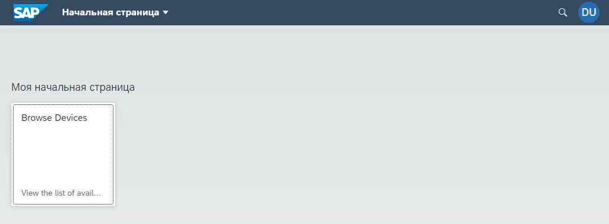


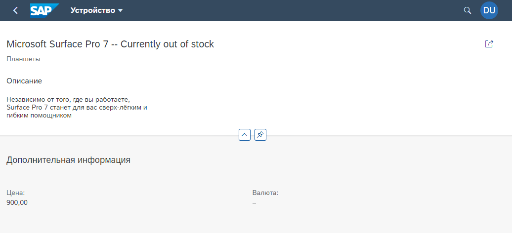
